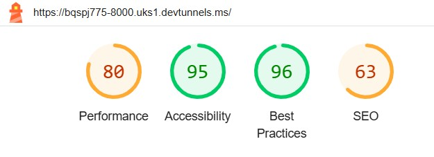
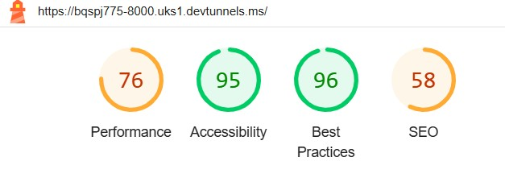

# BUFF GYM -  Testing

Visit the deployed site: 

- - -

## CONTENTS

* [AUTOMATED TESTING](#automated-testing)
  * [W3C Validator](#w3c-validator)
  * [Lighthouse](#lighthouse)
* [MANUAL TESTING](#manual-testing)
  * [Testing User Stories](#testing-user-stories)
  * [Full Testing](#full-testing)

Testing was ongoing throughout the build. I utilised Chrome developer tools whilst building to pinpoint and troubleshoot any issues as I went along.

During development I made use of google developer tools to ensure everything was working correctly and to assist with troubleshooting when things were not working as expected.

I utilised the console in the developer tools to work through small sections of JavaScript and ensure that the code was working, and also to troubleshoot where issues were.

I have gone through each page using google chrome developer tools & Firefox inspector tool to ensure that each page is responsive on a variety of different screen sizes and devices.

- - -

## AUTOMATED TESTING

### W3C Validator

[W3C](https://validator.w3.org/) was used to validate the HTML on all pages of the website. It was also used to validate the CSS.

* W3 Error .
* When I tried to take it out, the imagery was in the wrong place. After speaking to my mentor, I have removed the ID and it now comes up with no errors.
* booking.html - Passed, no errors
* success.html - Passed, no errors.

* style.css - Passed, no errors found.

- - -

### Lighthouse

I used Lighthouse within the Chrome Developer Tools to test the performance, accessibility, best practices and SEO of the website.

### Desktop Results

 

The main performance issues are with image sizing and external font retrieval.
The SEO issues are just because the website has not been deployed amd searchable yet.

### Mobile Results

The performance results are, again, because of image sizing and external retrieval.
The SEO issues are the same as desktop.

## MANUAL TESTING

### Testing User Stories

`First Time Visitors`

| Goals | How are they achieved? |
| :--- | :--- |
| I want to see what the gym has to offer | The BUFF GYM homepage has all the information that the user needs, in regards to classes and opening times. |
| I want the site to be responsive to my device. | I have developed the site with responsiveness in mind. |
| I want the site to be easy to navigate. | Buttons are used throughout the site for navigation, much like a mobile app. There is a header, which has all buttons to take to straight to the section the user is interested in. The page logo also acts as a clickable link to the home page.  |
| I want to be able to see members of staff. | There is a section, which shows the various members of staff and which classes they take. |
| I want to be able to find the contact details of the gym | The user can navigate to these by either scrolling down to the footer, or by using the clickable link in the navbar at te head of the page. |

`Returning Visitors`

|  Goals | How are they achieved? |
| :--- | :--- |
| I want to be able to quickly access the section I am interested in. | Users can quickly and easily use the navbar, located in the header of the main page, booking page, or the success page. |

`Frequent Visitors`

| Goals | How are they achieved? |
| :--- | :--- |
| I want to know that everything is where I expect it to be. | The user will find the sections they want will not change over time and, therefore will become familiar. |

- - -

### Full Testing

Full testing was performed on the following devices:

* Laptop:
  * Dell Inspiron 15" screen
* Mobile Devices:
  * iPhone 12.
  

Each device tested the site using the following browsers:

* Google Chrome
* Safari

`Home Page`

| Feature | Expected Outcome | Testing Performed | Result | Pass/Fail |
| --- | --- | --- | --- | --- |
| The Sites logo | Link directs the user back to the home page | Clicked logo | Home page reloads | Pass |
| Navbar | Displays Home, Classes, Meet the Team, Contact | Clicked on button | Takes you to the desired section | Pass |
| Book Now button | Directs users to the booking form | Clicked on button | Opens the booking page | Pass |
| 2nd Book Now button | Directs user to the booking form | Clicked on button | Opens the booking page | Pass |

`Booking Page`

| Feature | Expected Outcome | Testing Performed | Result | Pass/Fail |
| --- | --- | --- | --- | --- |
| The Site's logo | Link directs the user back to the home page | Clicked logo | Home page reloads | Pass |
| Navbar | Displays Home, Classes, Meet the Team, Contact | Clicked on button | Takes you to the desired section | Pass |
| Name Entry | The user should enter their name into this box | I entered my name (the form wouldn't complete unless this happened) | The form was filled in correctly | Pass |
| Email Entry | The box should contain an email address | I entered an email address. The form showed an error message after Submit was pressed when this entry was anything but an email address | Email address worked successfully | Pass |
| Phone number entry | the box only allows phone numbers | Error message when clicked submit if this box contains anything other than a phone number | Phone number successfully worked | Pass |
| Submit button | Clicking on this button will take you back to the Success page | Clicked the submit button | Directed to the Success page | Pass |

